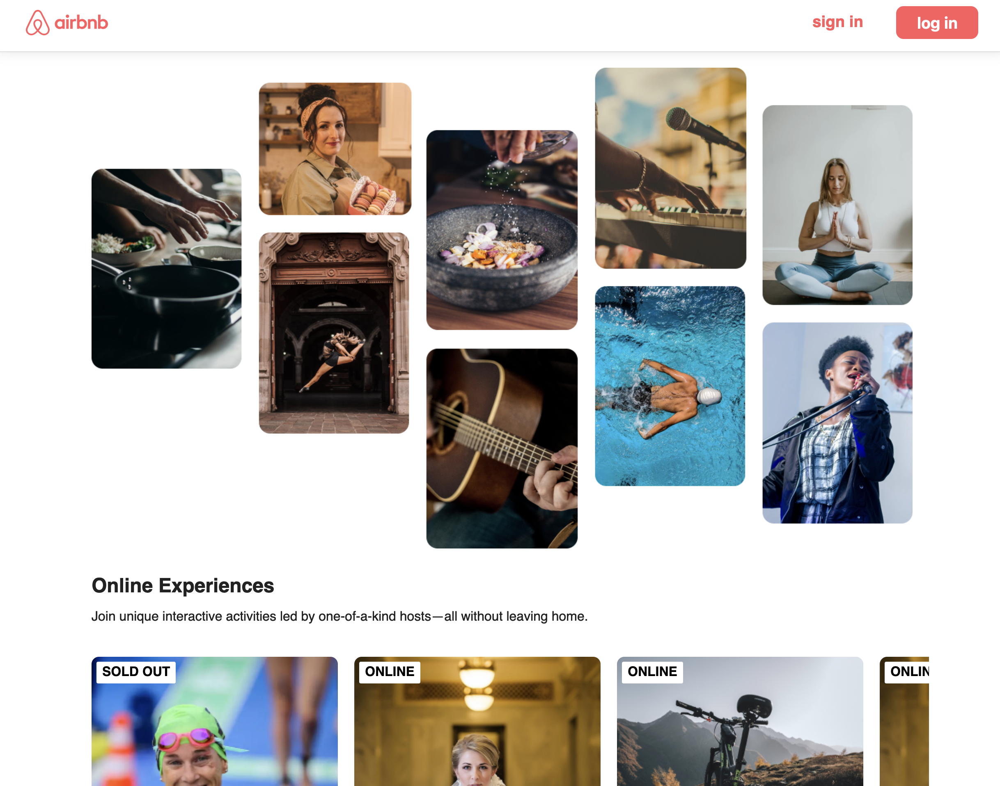

<h1>✈️ Airbnb clone</h1>

<h2>📝 Overview</h2>

<p>
    As the first project in my <strong><font color="red">ReactJs</font></strong> learning journey, I created an Airbnb clone website. This project helped me understand key React concepts while building a functional interface similar to the Airbnb platform.
</p>
<h2>⬇️ installation</h2>
<ol>
    <li>
        Clone the repository:
        <pre><code class="language-bash">git clone repository-url airBnbClone</code></pre>
        <pre><code class="language-bash">cd airBnbClone</code></pre>
    </li>
        <li>
        Start the project:
        <pre><code class="language-bash">npx run dev</code></pre>
    </li>
</ol>
<h2>🛠️ Usage</h2>
    <p>Open the browser </p>
    <pre><code class="language-bash">http://localhost:3000</code></pre>

## 💡 Learned Concepts
* **ReactJS components**:
   ```javascript
        export default function Header(){
            return (
            <nav className='nav-items'>
                
                <ul className='nav--links'>
                    <a href='#' className='nav--signin'>sign in</a>
                    <button className='nav--login'>log in</button>
                </ul>
            </nav>
            )
        }
        
    ```

<h2>📑 Documentation </h2>

[ReactJs](https://react.dev/learn)
<h2>💬 Tools and languages</h2>
<a href="https://react.dev" target="_blank" ></a>
<a href="https://www.npmjs.com" target="_blank" ></a>
<a href="https://nodejs.org/en" target="_blank" ></a>
<a href="https://developer.mozilla.org/en-US/docs/Web/HTML" target="_blank" ></a>
<a href="https://developer.mozilla.org/en-US/docs/Web/CSS" target="_blank" ></a>

<br />
<br />
<h4> 📌 For now im working on adding authentication system to the app <h4>

<h2>👨‍💻 Happy coding</h2>

